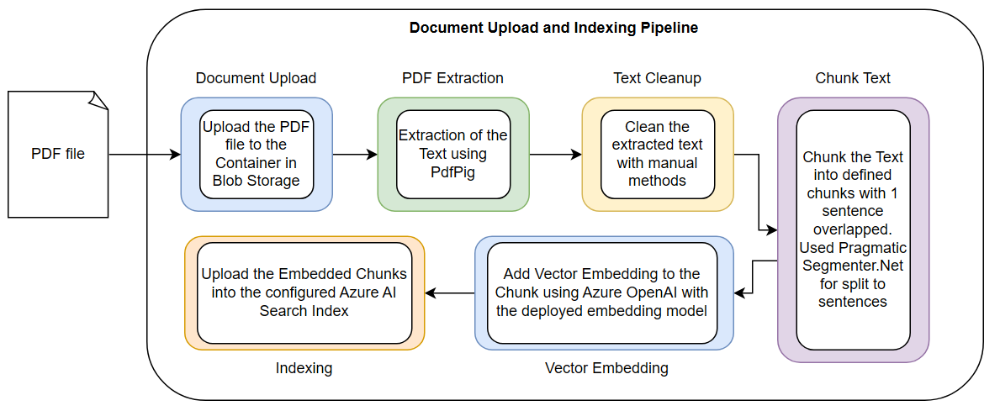
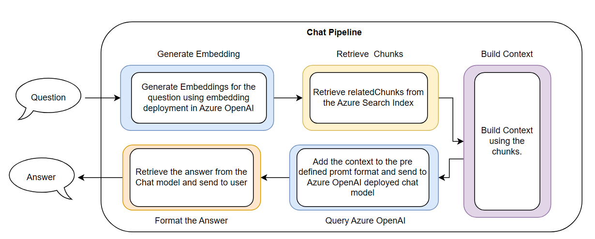
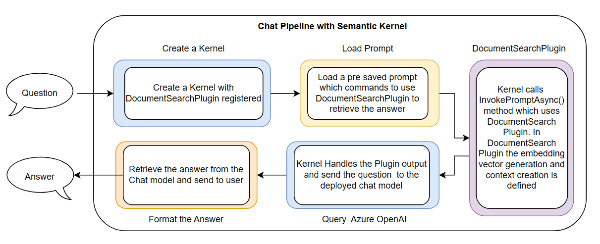
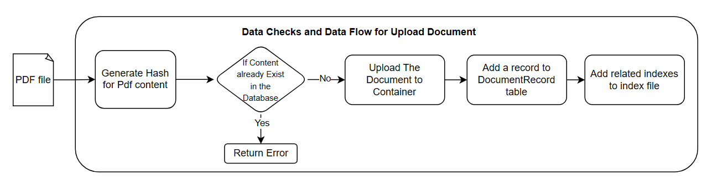
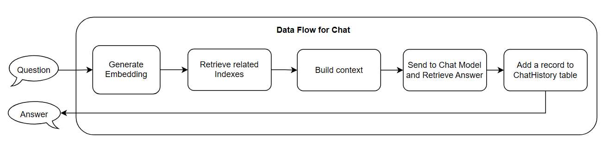
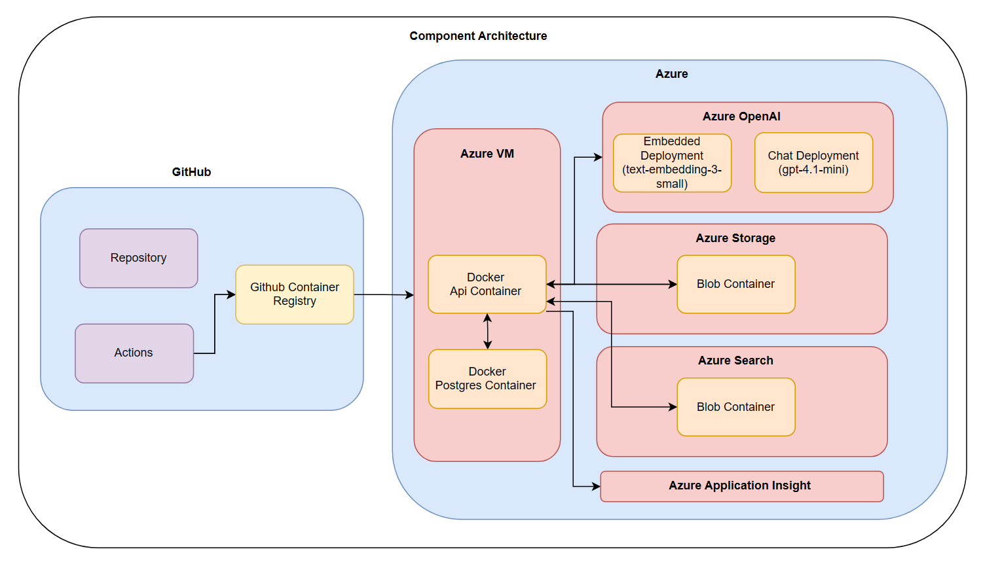
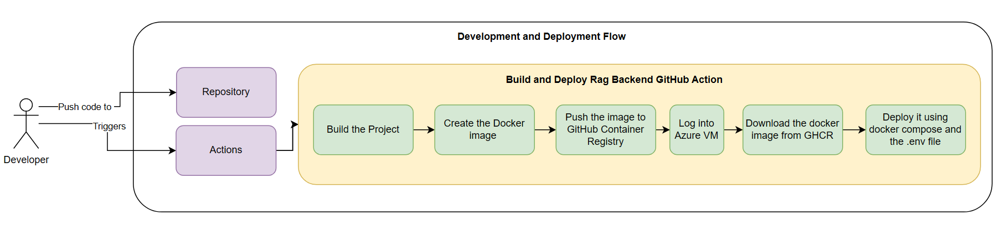

# Azure C# RAG

This repository contains the backend for a cloud-native Retrieval-Augmented Generation (RAG) system built with ASP.NET Core, Azure OpenAI, Azure AI Search, Azure Semantic Kernel, and Azure Blob Storage. The project exposes APIs for uploading documents and querying them through a context-grounded chat pipeline. The system accepts PDF files and, once a PDF is uploaded, stores the document in Azure Blob Storage, extracts the text using the PdfPig library, splits the text into chunks, generates embedding vectors using the configured embedding model, and indexes those chunks in Azure AI Search. When a user submits a question, the system generates a query embedding, retrieves the most relevant chunks from Azure AI Search, builds a context from those retrieved chunks, and then sends that context to the deployed chat model using the configured system prompt. The current prompt is configured for research-assistant-style answers grounded in uploaded research papers. Current deployment uses text-embedding-3-small as the embeddeing deployment and gpt-4.1-mini as the chat deployment.

This project is currently deployed through a GitHub-based delivery workflow. The source code is stored in GitHub, and a deploy GitHub Action is executed to build the Docker image, push it to GitHub Container Registry, connect to the Azure Virtual Machine, pull the latest image from the registry, and start the containerized ASP.NET Core API on the VM. The deployed application then connects to Azure Blob Storage, Azure AI Search, Azure OpenAI, and Application Insights for storage, retrieval, model inference, and monitoring.

To evaluate retrieval performance, the system also includes an API that can run Recall@K, Precision@K, MRR, Boundary, and NoAnswer False Positive tests across different configurations.

### Performace Evaluation of the System

Recall@K, Precision@K, MRR, Boundary, and NoAnswer False Positive tests were run for the system using different chunk sizes (`250`, `350`, `500`, `750`, `1000`) and different TopK values (`1`, `3`, `5`, `7`, `10`) to evaluate retrieval performance across configurations.

[Further Details in Performance Evaluation](#Performance-Evaluation)

#### Evaluation Table

The following table shows percentage-based evaluation results for the configured embedding deployment and tested chunk-size and TopK combinations.

<table>
  <thead>
    <tr>
      <th rowspan="2">Chunk Size</th>
      <th colspan="5">Recall@ Test</th>
      <th colspan="5">Precision@ Test</th>
      <th colspan="5">MRR@ Test</th>
      <th colspan="5">Hit@ Test</th>
      <th colspan="5">False Positive@ Test</th>
    </tr>
    <tr>
      <th>Top1</th><th>Top3</th><th>Top5</th><th>Top7</th><th>Top10</th>
      <th>Top1</th><th>Top3</th><th>Top5</th><th>Top7</th><th>Top10</th>
      <th>Top1</th><th>Top3</th><th>Top5</th><th>Top7</th><th>Top10</th>
      <th>Top1</th><th>Top3</th><th>Top5</th><th>Top7</th><th>Top10</th>
      <th>Top1</th><th>Top3</th><th>Top5</th><th>Top7</th><th>Top10</th>
    </tr>
  </thead>
  <tbody>
    <tr>
      <td>250</td>
      <td>49.41</td><td>77.65</td><td>79.41</td><td>80.59</td><td>80.59</td>
      <td>65.88</td><td>42.75</td><td>28.24</td><td>20.84</td><td>14.71</td>
      <td>65.88</td><td>78.04</td><td>76.67</td><td>77.25</td><td>77.25</td>
      <td>65.88</td><td>92.94</td><td>94.12</td><td>95.29</td><td>95.29</td>
      <td>100</td><td>100</td><td>100</td><td>100</td><td>100</td>
    </tr>
    <tr>
      <td>350</td>
      <td>48.82</td><td>72.94</td><td>74.12</td><td>74.12</td><td>75.29</td>
      <td>62.35</td><td>38.82</td><td>24.24</td><td>17.31</td><td>12.24</td>
      <td>62.35</td><td>73.73</td><td>72.06</td><td>72.06</td><td>73.24</td>
      <td>62.35</td><td>89.41</td><td>89.41</td><td>89.41</td><td>90.59</td>
      <td>100</td><td>100</td><td>100</td><td>100</td><td>100</td>
    </tr>
    <tr>
      <td>500</td>
      <td>44.12</td><td>77.06</td><td>77.06</td><td>77.65</td><td>78.24</td>
      <td>57.65</td><td>39.61</td><td>24.47</td><td>17.65</td><td>12.47</td>
      <td>57.65</td><td>76.86</td><td>76.67</td><td>76.37</td><td>75.49</td>
      <td>57.65</td><td>92.94</td><td>92.94</td><td>92.94</td><td>92.94</td>
      <td>100</td><td>100</td><td>100</td><td>100</td><td>100</td>
    </tr>
    <tr>
      <td>750</td>
      <td>70.59</td><td>79.41</td><td>79.41</td><td>79.41</td><td>80.59</td>
      <td>94.12</td><td>37.25</td><td>22.35</td><td>15.97</td><td>11.29</td>
      <td>94.12</td><td>85.29</td><td>85.29</td><td>85.29</td><td>86.47</td>
      <td>94.12</td><td>94.12</td><td>94.12</td><td>94.12</td><td>95.29</td>
      <td>100</td><td>100</td><td>100</td><td>100</td><td>100</td>
    </tr>
    <tr>
      <td>1000</td>
      <td>64.71</td><td>77.65</td><td>78.82</td><td>78.82</td><td>83.53</td>
      <td>85.88</td><td>38.43</td><td>23.76</td><td>17.14</td><td>12.59</td>
      <td>85.88</td><td>87.45</td><td>85.98</td><td>85.98</td><td>86.08</td>
      <td>85.88</td><td>95.29</td><td>95.29</td><td>95.29</td><td>98.82</td>
      <td>100</td><td>100</td><td>100</td><td>100</td><td>100</td>
    </tr>
  </tbody>
</table>

## System Architecture

### Technology Used for the project

- ASP.NET Core / .NET 8: used to build the backend API and orchestrate the document ingestion, indexing, retrieval, and chat workflows.
- Azure Blob Storage: used to store uploaded PDF documents before and during processing.
- Azure AI Search: used to index document chunks and perform vector-based retrieval for relevant context.
- Azure OpenAI: used to generate embeddings for document chunks and user questions, and to generate grounded chat responses.
- Semantic Kernel: used to provide an alternate plugin-based query path for context retrieval and answer generation.
- PostgreSQL: used to persist document metadata and chat history.
- Entity Framework Core: used as the ORM layer for database access and migrations.
- PdfPig: used to extract text content from uploaded PDF files.
- Docker / Docker Compose: used to run the API and PostgreSQL locally in a containerized setup.
- Application Insights: used for telemetry and application monitoring.
- xUnit and Moq: used for unit testing and dependency mocking in the test projects.

### Architecture Diagrams

#### The document upload pipeline.

This diagram shows how a PDF document moves through the upload and indexing pipeline, from API request to blob storage, text extraction, chunk generation, embedding creation, and Azure AI Search indexing.



#### The question and answer pipeline.

This diagram shows how a user question is processed through the standard RAG pipeline, including query embedding generation, chunk retrieval from Azure AI Search, context building, and answer generation using Azure OpenAI.



#### The question and answer pipeline with Semantic Kernel.

This diagram shows how the Semantic Kernel-based query path works, including kernel creation, plugin registration, automatic plugin invocation, context retrieval, and final answer generation.



### Data Flow Diagram


#### DataFlow and Data Checks for Uploading a Document.



#### DataFlow for Chat Endpoint.




## Deployment and Hosting Architecture

This project is deployed through GitHub Actions using a Docker-based delivery pipeline. The workflow builds the Docker image, pushes it to GitHub Container Registry, connects to the Azure Virtual Machine, pulls the latest image, and runs the containerized ASP.NET Core API.

### Components Architecture



### Development and Deployment Architecture



## APIs and Features

### APIs

The following APIs are implemented in the backend.

#### 1. PDF documents upload with the option to index during upload

 ```
  Method: POST
  Endpoint: api/documents/upload
 ```

  Form Data:

  - File : PDF to upload
  - Indexing: True or False (Default False)

#### 2. Manual indexing pipeline for processing stored documents

```
  Method: POST
  Endpoint: api/indexing/run
```

#### 3. Context-driven chat responses using retrieved document chunks

```
  Method: POST
  Endpoint: api/query/chat
```
  Request Body:

  - question : Question to Ask

#### 4. Alternate query path using Semantic Kernel
```
  Method: POST
  Endpoint: api/query/chat/sk
```
  Request Body:

  - question : Question to Ask

#### 5. Performance evaluation pipeline for retrieval benchmarking
```
  Method: POST
  Endpoint: api/performance/evaluation
```

### Features in the System

- Embedding Model, Chat Model, Index File Name, Chunk Size, TopK and All Azure Settings are configurable for the system via Appsettings.json (or .Env file)
- Text extraction, cleanup, and chunking for document preparation
- Embedding generation with Azure OpenAI
- Vector search with Azure AI Search
- PostgreSQL persistence for document metadata and chat history
- Duplicate document detection using content hashing
- Centralized exception handling, request logging, and correlation tracking
- Azure Application Insight Used for Logging handling
- Performance Evaluation is configurable for Embedding Model, TopK, Chat Model, ChunkSize.
- Automated Azure AI Search index initialization at startup
- Docker-based local runtime with API and PostgreSQL services


## Project structure

This section shows the high-level folder layout of the solution, including the main API project, Semantic Kernel components, performance evaluation modules, and the unit and integration test projects. It provides a quick overview of where the core application logic, configuration, infrastructure, and test code are organized.

```text
AzureCSharpRAGAssistant.sln
Dockerfile
docker-compose.yml
README.md

src/
  AzureCSharpRAGAssistant.Api/
    Controllers/
      DocumentsController.cs
      IndexingController.cs
      QueryController.cs
    Performance/
      Controllers/
      Data/
        EvaluationConfig/
        Files/
        TestMetrics/
      Helpers/
      Services/
    SemanticKernel/
      Factory/
      Plugins/
      Prompts/
      Services/
    Middleware/
    Filters/
    Validators/
    Exceptions/
    Data/
    Helpers/
    Migrations/
    Properties/
    Contracts/
      Requests/
      Results/
      Settings/
    Services/
      Chat/
      ChatHistories/
      ContextBuilder/
      Documents/
      Embedding/
      Extraction/
      Indexing/
      Processing/
      Storage/
    Models/
    Program.cs
    appsettings.json
    appsettings.Development.json

tests/
  AzureCSharpRAGAssistant.Api.Tests/
    Controllers/
      DocumentsControllerTests.cs
      IndexingControllerTests.cs
    Contracts/
      Requests/
      Settings/
    Helpers/
    Middleware/
    Services/
      Extraction/
      Processing/
  AzureCSharpRAGAssistant.Api.IntegrationTests/
    Services/
      Extraction/
      Processing/
```
- src/: contains the main ASP.NET Core API application, including controllers, services, models, configuration, middleware, and infrastructure code.
- src/AzureCSharpRAGAssistant.Api/SemanticKernel/: contains the Semantic Kernel-based query flow, including kernel factory setup, prompt files, plugins, and Semantic Kernel answer services.
- src/AzureCSharpRAGAssistant.Api/Performance/: contains the performance evaluation pipeline, evaluation configuration, test datasets, helper utilities, and the performance controller used for retrieval benchmarking.
- tests/: contains the unit and integration test projects for controllers, middleware, services, extraction, processing, and configuration validation.
- docs/: contains architecture diagrams, flow diagrams, and other documentation assets used by the README.

## Performance Evaluation

Evaluation runs are configured through `src/AzureCSharpRAGAssistant.Api/Performance/Data/EvaluationConfig/evaluation-config.json`, and the benchmark dataset is defined in `src/AzureCSharpRAGAssistant.Api/Performance/Data/TestMetrics/evaluation.json`. The executed test types include Recall@K, Precision@K, MRR, Hit@K, Boundary, and NoAnswer False Positive evaluation. Summary outputs for each evaluated chunk size are saved under `docs/testresults`.

- Chunk size `250`: [text-embedding-3-small_chunksize_250_summary.txt](docs/testresults/text-embedding-3-small_chunksize_250_summary.txt)
- Chunk size `350`: [text-embedding-3-small_chunksize_350_summary.txt](docs/testresults/text-embedding-3-small_chunksize_350_summary.txt)
- Chunk size `500`: [text-embedding-3-small_chunksize_500_summary.txt](docs/testresults/text-embedding-3-small_chunksize_500_summary.txt)
- Chunk size `750`: [text-embedding-3-small_chunksize_750_summary.txt](docs/testresults/text-embedding-3-small_chunksize_750_summary.txt)
- Chunk size `1000`: [text-embedding-3-small_chunksize_1000_summary.txt](docs/testresults/text-embedding-3-small_chunksize_1000_summary.txt)

## Testing status

A dedicated test project exists at `tests/AzureCSharpRAGAssistant.Api.Tests`.

testing setup:

- `xUnit` as the test framework
- `Moq` for mocking dependencies
- unit tests currently cover:
  - controllers: `DocumentsController`, `IndexingController`
  - middleware: correlation ID, exception handling, request/response logging
  - services: `DocumentProcessingService`, `ChunkingService`, `TextCleanupService`, `PdfExtractionService`
  - contracts and settings validation: `QueryRequest`, Azure settings, folder settings, and chunk settings

unit testing approach:

- services and controllers are tested by mocking dependencies and asserting:
  - returned action results
  - whether dependent services were called
  - expected processing and validation behavior
  - configuration binding and model validation behavior

A dedicated Integration test project exists at `tests/AzureCSharpRAGAssistant.Api.IntegrationTests`.

- integration tests currently cover:
  - PDF extraction with embedded test files
  - chunking behavior across processing scenarios

## Notes

- The application is built on `.NET 8`.
- Dependency injection is already in place for controllers and services, which makes unit testing straightforward.
- External integrations such as Azure OpenAI, Azure AI Search, and Azure Blob Storage should be mocked in unit tests and covered end-to-end with separate integration tests later.
